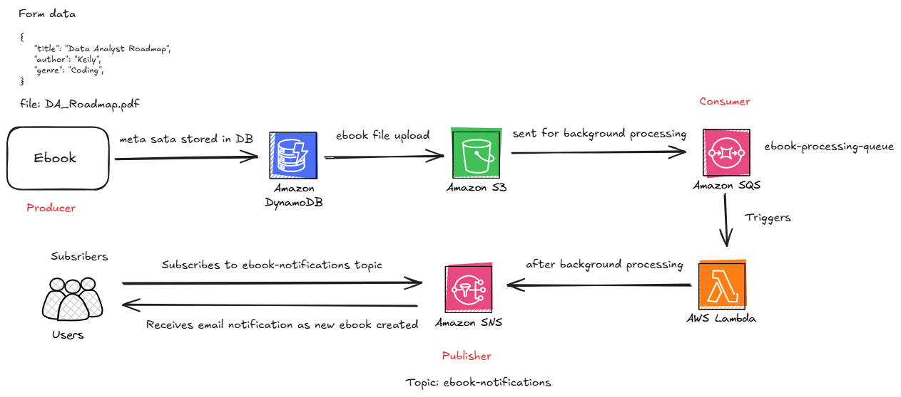

# 📚 E-Book Management System

The **E-Book Management System** is a Spring Boot application designed to manage eBooks and their associated metadata. It allows users to upload eBook PDFs and cover images to an **AWS S3 bucket**, stores metadata in **AWS DynamoDB**, and supports background processing via **SQS**, with **SNS** notifications to subscribers when a new eBook is created.

---
## ⚙️ Architecture Overview

### ➕ New eBook Upload Workflow:

1. User uploads a new eBook via REST API.
2. The application stores the file(s) in **Amazon S3**.
3. eBook metadata is saved in **Amazon DynamoDB**.
4. A message is sent to an **SQS Queue** for background tasks (e.g., indexing, logging).
5. Once processing is complete, an **SNS Notification** is published to subscribers (e.g., email notification about the new eBook).



---
## 🚀 Features

- Upload eBook PDFs and cover images to AWS S3.
- Store and manage eBook metadata (title, author, category, description, etc.) in DynamoDB.
- Retrieve, update, and delete eBook metadata.
- Generate pre-signed URLs for secure file downloads from S3.
- Asynchronous background processing using SQS.
- Email notifications to subscribers using SNS.
- Scalable and cloud-native architecture.

---

## 🧱 Tech Stack

- **Backend**: Spring Boot, Java 17+
- **Database**: AWS DynamoDB
- **File Storage**: AWS S3
- **Asynchronous Processing**: Amazon SQS
- **Notifications**: Amazon SNS
- **Build Tool**: Maven
- **Cloud SDK**: AWS SDK v2 (DynamoDB, S3, SQS, SNS)
- **Persistence Layer**: Spring Data DynamoDB
---

## 📝 Setup Instructions

### ✅ Prerequisites

- **Java 17** or later
- **Maven** (for dependency management and build)
- **AWS CLI** configured locally with valid credentials
- AWS resources set up:
    - S3 bucket for file storage
    - DynamoDB table for eBook metadata
    - SQS queue for background processing
    - SNS topic with email subscriptions

### 🛠️ Build & Run

```bash
# Clone the repo
git clone https://github.com/your-username/ebook-management-system.git
cd ebook-management-system

# Build the project
mvn clean install

# Run the application
mvn spring-boot:run
